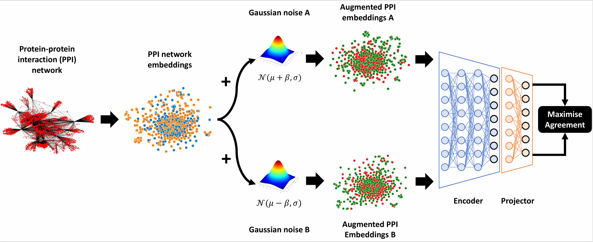

# Predicting the pro-longevity or anti-longevity effect of model organism genes with enhanced Gaussian noise augmentation-based contrastive learning on protein-protein interaction networks
This is a python implementation of the Enhanced Gaussian noise augmentation-based contrastive learning method (EGsCL) reported in:
```
@article{...,
  title={Predicting the pro-longevity or anti-longevity effect of model organism genes with enhanced Gaussian noise augmentation-based contrastive learning on protein-protein interaction networks},
  author={Alsaggaf, Ibrahim and Freitas, Alex A. and Wan, Cen},
  journal={...},
  pages={...},
  year={...},
  publisher={...},
  note={Submitted for publication to NAR Genomics and Bioinformatics, July 2024.}
}
```

<p align="center">
  
</p>

# Usage
This repository contains the implementation of EGsCL. The implementation is built in Python3 (version 3.10.12) using Scikit-learn and the deep learning library Pytorch. 

## Requirements
- torch==2.1.1
- scikit-learn==1.4.0

## Tutorial
The implementation should run on a machine with at least 5 cores, 20 GB memory and 1 GPU. To run this implementation you need to do the following steps:
1. Make sure all the requirements stated above are installed.
2. Navigate to your working directory where the `.py` files are stored (e.g. src).
3. Execute the following command:
```
python3 main.py\
--X [full path to the embeddings or binary matrix]\
--y [full path to the class labels (pro-longevity or anti-longevity)]\
--delimiter [the delimiter used in X (e.g. ',', ' ', ...)]\
--header [if X has a header set the value to 1 and 0 otherwise (e.g. 0 for embeddings and 1 for binary)]\
--X2 [full path to the embeddings or binary matrix (only used for combined experiments)]\
--delimiter2 [the delimiter used in X2 (only used for combined experiments)]\
--header2 [if X2 has a header set the value to 1 and 0 otherwise (only used for combined experiments)]\
--beta [a mean-shift hyperparameter to shift the Gaussian distribution, possible values are 0.0, a positive float number, or fixed]\
--loss [the name of the contrastive loss function (SupCon or SimCLR)]\
--val_metric [the metric used for model selection (mcc, f1, or ap)]\
--train_size [the training set size when splitting the data]\
--cv [the number of cross validation folds]\
--batch_size [the batch size, to use all training samples pass the value -1]\
--epochs [the number of contrastive learning epochs]\
--step [the number of steps to measure validation performance]\
--lr [learning rate]\
--wd [weight decay]\
--temperature [a temperature hyperparameter for contrastive learning]\
--seed [set a seed for reproducibility]\
--gpu [the gpu device number (e.g. 0)]\
--res_path [the path where the results will be saved]
```
### Examples
In the examples below, we assume that all files are in the current directory.

To run the enhanced Gaussian noise augmentation-based supervised contrastive learning method (**Sup-EGsCL**), where the two augmentations are generated by adding two Gaussain noises that are drawn from two different Gaussian distributions, i.e. $N(\mu + \beta, \sigma)$ and $N(\mu - \beta, \sigma)$, execute:
```
python3 main.py\
--X Mouse_Embedding_Features.txt\
--y Mouse_Binary_PPI_Labels.txt\
--delimiter , --header 0\
--beta 0.5 --loss SupCon --temperature 0.1\
--val_metric mcc --train_size 0.8 --cv 10\
--batch_size -1 --epochs 1000 --step 1 --lr 1e-4 --wd 1e-6 --seed 1111\
--res_path [the path where the results will be saved]
```

To run the enhanced Gaussian noise augmentation-based self-supervised contrastive learning method (**Self-EGsCL**), where the two augmentations are generated by adding two Gaussain noises that are drawn from two different Gaussian distributions, i.e. $N(\mu + \beta, \sigma)$ and $N(\mu - \beta, \sigma)$, execute:
```
python3 main.py\
--X Mouse_Binary_PPI_Features.txt\
--y Mouse_Binary_PPI_Labels.txt\
--delimiter , --header 1\
--beta 0.5 --loss SimCLR --temperature 0.07\
--val_metric mcc --train_size 0.8 --cv 10\
--batch_size -1 --epochs 1000 --step 1 --lr 1e-4 --wd 1e-6 --seed 1111\
--res_path [the path where the results will be saved]
```
To run the Gaussian noise augmentation-based supervised contrastive learning method (**Sup-GsCL**), where the two augmentations are generated by adding two Gaussain noises that are drawn from the same Gaussian distribution, i.e. $N(\mu, \sigma)$, execute:
```
python3 main.py\
--X Fly_Embedding_Features.txt\
--y Fly_Binary_PPI_Labels.txt\
--delimiter " " --header 0\
--beta 0.0 --loss SupCon --temperature 0.1\
--val_metric mcc --train_size 0.8 --cv 10\
--batch_size -1 --epochs 1000 --step 1 --lr 1e-4 --wd 1e-6 --seed 1111\
--res_path [the path where the results will be saved]
```

To run the Gaussian noise augmentation-based self-supervised contrastive learning method (**Self-GsCL**), where the two augmentations are generated by adding two Gaussain noises that are drawn from the same Gaussian distribution, i.e. $N(\mu, \sigma)$, execute:
```
python3 main.py\
--X Fly_Binary_PPI_Features.txt\
--y Fly_Binary_PPI_Labels.txt\
--delimiter , --header 1\
--beta 0.0 --loss SimCLR --temperature 0.07\
--val_metric mcc --train_size 0.8 --cv 10\
--batch_size -1 --epochs 1000 --step 1 --lr 1e-4 --wd 1e-6 --seed 1111\
--res_path [the path where the results will be saved]
```

To run the Gaussian noise augmentation-based supervised contrastive learning method (**Sup-GsCL**) reported in [(Alsaggaf et al., 2024)](https://doi.org/10.1093/bfgp/elad059), where the two augmentations are generated by adding two Gaussain noises that are drawn from the same Gaussian distribution, i.e. $N(0, 1)$, execute:
```
python3 main.py\
--X Worm_Embedding_Features.txt\
--y Worm_Binary_PPI_Labels.txt\
--delimiter " " --header 0\
--beta fixed --loss SupCon --temperature 0.1\
--val_metric mcc --train_size 0.8 --cv 10\
--batch_size -1 --epochs 1000 --step 1 --lr 1e-4 --wd 1e-6 --seed 1111\
--res_path [the path where the results will be saved]
```

To run the Gaussian noise augmentation-based self-supervised contrastive learning method (**Self-GsCL**) reported in [(Alsaggaf et al., 2024)](https://doi.org/10.1093/bfgp/elad059), where the two augmentations are generated by adding two Gaussain noises that are drawn from the same Gaussian distribution, i.e. $N(0, 1)$, execute:
```
python3 main.py\
--X Worm_Binary_PPI_Features.txt\
--y Worm_Binary_PPI_Labels.txt\
--delimiter , --header 1\
--beta fixed --loss SimCLR --temperature 0.07\
--val_metric mcc --train_size 0.8 --cv 10\
--batch_size -1 --epochs 1000 --step 1 --lr 1e-4 --wd 1e-6 --seed 1111\
--res_path [the path where the results will be saved]
```

### The code
Here we briefly describe each `.py` file in the **code** folder.

`main.py` Runs the selected method.

`model.py` Includes the implementations of EGsCL and GsCL.

`data.py` Reads and preprocesses the given dataset.

`losses.py` Includes the contrastive learning losses SimCLR [(Chen et al., 2020)](http://proceedings.mlr.press/v119/chen20j.html) and SupCon [(Khosla et al., 2020)](https://proceedings.neurips.cc/paper/2020/hash/d89a66c7c80a29b1bdbab0f2a1a94af8-Abstract.html).

`networks.py` Includes the encoder architecture.

`utils.py` Includes some helper functions.

# Availability
The datasets used in this work and the pretrained encoders that obtained the best predictive performance for each organism (see Table 2) can be downloaded from [](https://doi.org/10.5281/zenodo.12143797).

# Acknowledgements
The authors acknowledge the support by the School of Computing and Mathematical Sciences and the Birkbeck GTA programme.
