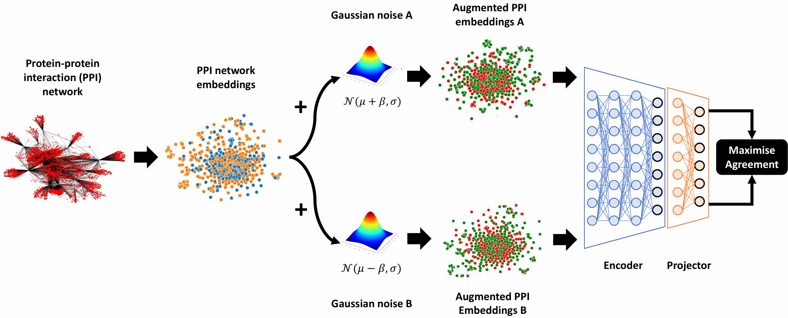

# AGsCL
This is a python implementation of the Asymmetric Gaussian noise augmentation-based contrastive learning method (AGsCL) reported in:
```
@article{...,
  title={Predicting the pro-longevity or anti-longevity effect of model organism genes with asymmetric Gaussian noise augmentation-based contrastive learning on protein-protein interaction networks},
  author={Alsaggaf, Ibrahim and Freitas, Alex and Wan, Cen},
  journal={...},
  pages={...},
  year={...},
  publisher={...}
}
```

<p align="center">
  
</p>

# Usage
This repository contains the implementation of AGsCL. The implementation is built in Python3 (version 3.10.12) using Scikit-learn and the deep learning library Pytorch. 

## Requirements
- torch==2.1.1
- scikit-learn==1.4.0

## Tutorial
The implementation should run on a machine with at least 5 cores, 20 GB memory and 1 GPU. To run this implementation you need to do the following steps:
1. Make sure all the requirements stated above are installed.
2. Navigate to your working directory where the `.py` files are stored (e.g. src).
3. Execute one of the following commands:

To run Sup-AGsCL execute:
```
python3 main.py\
--X [full path to X] --y [full path to y] --delimiter "," --header 0\
--beta 0.5\
--val_metric mcc --train_size 0.8 --cv 10\
--batch_size -1 --epochs 1000 --step 1 --lr 1e-4 --wd 1e-6\
--loss SupCon --temperature 0.1\
--seed 1111\
--res_path [the path where the results will be saved]
```
To run Self-AGsCL execute:
```
python3 main.py\
--X [full path to X] --y [full path to y] --delimiter "," --header 0\
--beta 0.5\
--val_metric mcc --train_size 0.8 --cv 10\
--batch_size -1 --epochs 1000 --step 1 --lr 1e-4 --wd 1e-6\
--loss SimCLR --temperature 0.07\
--seed 1111\
--res_path [the path where the results will be saved]
```
To run Sup-GsCL (beta=0) execute:
```
python3 main.py\
--X [full path to X] --y [full path to y] --delimiter "," --header 0\
--beta 0.0\
--val_metric mcc --train_size 0.8 --cv 10\
--batch_size -1 --epochs 1000 --step 1 --lr 1e-4 --wd 1e-6\
--loss SupCon --temperature 0.1\
--seed 1111\
--res_path [the path where the results will be saved]
```
To run Self-GsCL (beta=0) execute:
```
python3 main.py\
--X [full path to X] --y [full path to y] --delimiter "," --header 0\
--beta 0.0\
--val_metric mcc --train_size 0.8 --cv 10\
--batch_size -1 --epochs 1000 --step 1 --lr 1e-4 --wd 1e-6\
--loss SimCLR --temperature 0.07\
--seed 1111\
--res_path [the path where the results will be saved]
```
To run Sup-GsCL [(Alsaggaf et al., 2024)](https://doi.org/10.1093/bfgp/elad059) execute:
```
python3 main.py\
--X [full path to X] --y [full path to y] --delimiter "," --header 0\
--beta fixed\
--val_metric mcc --train_size 0.8 --cv 10\
--batch_size -1 --epochs 1000 --step 1 --lr 1e-4 --wd 1e-6\
--loss SupCon --temperature 0.1\
--seed 1111\
--res_path [the path where the results will be saved]
```
To run Self-GsCL [(Alsaggaf et al., 2024)](https://doi.org/10.1093/bfgp/elad059) execute:
```
python3 main.py\
--X [full path to X] --y [full path to y] --delimiter "," --header 0\
--beta fixed\
--val_metric mcc --train_size 0.8 --cv 10\
--batch_size -1 --epochs 1000 --step 1 --lr 1e-4 --wd 1e-6\
--loss SimCLR --temperature 0.07\
--seed 1111\
--res_path [the path where the results will be saved]
```

### The code
Here we briefly describe each `.py` file in the **code** folder.

`main.py` Runs the AGsCL method.

`model.py` Includes the implementation of AGsCL.

`data.py` Reads and preprocesses the given dataset.

`losses.py` Includes the contrastive learning losses SimCLR [(Chen et al., 2020)](http://proceedings.mlr.press/v119/chen20j.html) and SupCon [(Khosla et al., 2020)](https://proceedings.neurips.cc/paper/2020/hash/d89a66c7c80a29b1bdbab0f2a1a94af8-Abstract.html).

`networks.py` Includes the encoder architecture.

`utils.py` Includes some helper functions.

# Availability
The datasets used in this work and the pretrained encoders that obtained the best predictive performance for each organism can be downloaded from [](https://doi.org/10.5281/zenodo.12143797).

# Acknowledgements
The authors acknowledge the support by the School of Computing and Mathematical Sciences and the Birkbeck GTA programme.
